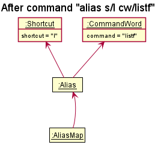
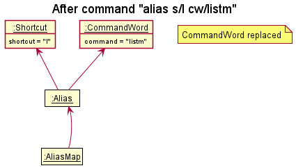
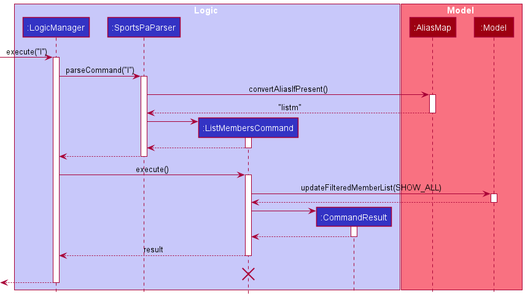
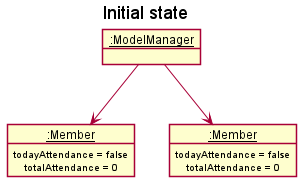
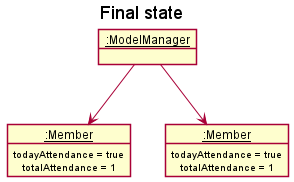
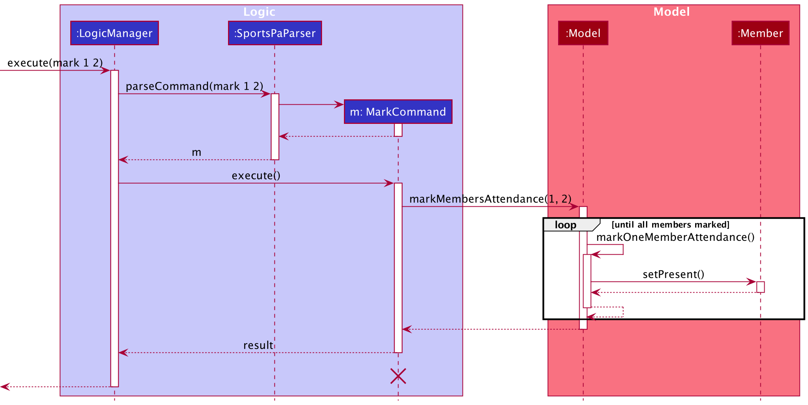
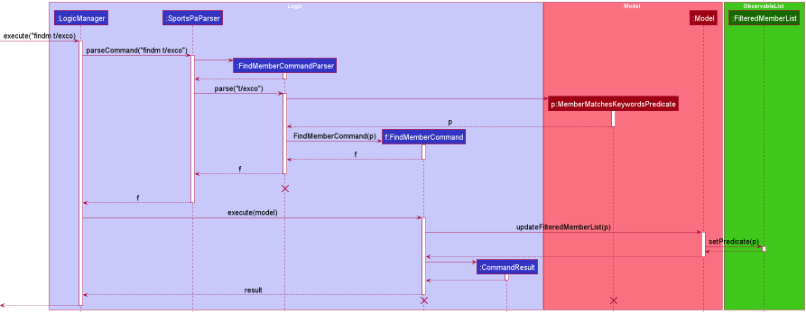
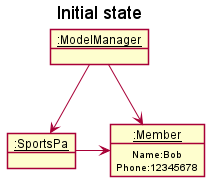
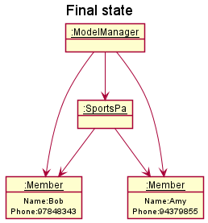

Welcome to the SportsPA Developer Guide!

* Table of Contents
  {:toc}

--------------------------------------------------------------------------------------------------------------------
## **Introduction**

SportsPA is a desktop application for NUS sports CCA Leaders to manage membership and
training sessions, optimized for use via a *Command Line Interface* (CLI), while still preserving the benefits of a *Graphical User Interface* (GUI).

SportsPA is highly optimized for *fast typists* and can be fully operated through keyboard commands.

This developer guide is intended to be a one-stop source for anyone interested in extending and modifying `SportsPA`.
For certain terms that are unique to `SportsPA`, a [glossary](#glossary) has been provided for readers.

--------------------------------------------------------------------------------------------------------------------
## Using this Developer Guide

You can click on the links in the [Table of Contents](#table-of-contents) to quickly navigate to your desired location in
this Developer Guide. A link to return to the [Table of Contents](#table-of-contents) is also provided at the end of every section.
 
The table below summarizes the meaning of the icons and text styles used throughout this Developer Guide.
 

Syntax | Description
----------------- | ------------------
**bold**        | Highlights important information such as components of SportsPA or constraints of command parameters
*italics* | Terms to be defined in the [glossary](#glossary)  
`Codeblock`          | Represents distinct classes, and their methods
[link](#table-of-contents) | Represents links that can be clicked on to navigate to a relevant section of the User Guide or a different website
**:information_source: Notes:** | Represents important information to note
**:bulb: Tip:**| Represents useful tips that we would like to share

[Back to Table of Contents](#table-of-contents)

--------------------------------------------------------------------------------------------------------------------
## **Acknowledgements**

* Based on AddressBook-Level3 project created by the [SE-EDU initiative](https://se-education.org/).

--------------------------------------------------------------------------------------------------------------------

## **Setting up, getting started**

Refer to the guide [_Setting up and getting started_](SettingUp.md).

**:information_source: Note:** Readers are advised to [download](https://github.com/AY2122S1-CS2103T-W12-1/tp/releases) SportsPA's latest release to test the application.

--------------------------------------------------------------------------------------------------------------------

## **Design**

:bulb: **Tip:** The `.puml` files used to create diagrams in this document can be found in
the [diagrams](https://github.com/se-edu/addressbook-level3/tree/master/docs/diagrams/) folder. Refer to the [_PlantUML
Tutorial_ at se-edu/guides](https://se-education.org/guides/tutorials/plantUml.html) to learn how to create and edit
diagrams.

### Architecture

The ***Architecture Diagram*** given above explains the high-level design of the App.

Given below is a quick overview of main components and how they interact with each other.

**Main components of the architecture**

**`Main`** has two classes
called [`Main`](https://github.com/AY2122S1-CS2103T-W12-1/tp/blob/master/src/main/java/seedu/address/Main.java)
and [`MainApp`](https://github.com/AY2122S1-CS2103T-W12-1/tp/blob/master/src/main/java/seedu/address/MainApp.java). It
is responsible for,

* At app launch: Initializes the components in the correct sequence, and connects them up with each other.
* At shut down: Shuts down the components and invokes cleanup methods where necessary.

[**`Commons`**](#common-classes) represents a collection of classes used by multiple other components.

The rest of the App consists of four components.

* [**`UI`**](#ui-component): The UI of the App.
* [**`Logic`**](#logic-component): The command executor.
* [**`Model`**](#model-component): Holds the data of the App in memory.
* [**`Storage`**](#storage-component): Reads data from, and writes data to, the hard disk.

Each of the four main components (also shown in the diagram above),

* defines its *API* in an `interface` with the same name as the Component.
* implements its functionality using a concrete `{Component Name}Manager` class (which follows the corresponding
  API `interface` mentioned in the previous point.

For example, the `Logic` component defines its API in the `Logic.java` interface and implements its functionality using
the `LogicManager.java` class which follows the `Logic` interface. Other components interact with a given component
through its interface rather than the concrete class (reason: to prevent outside component's being coupled to the
implementation of a component), as illustrated in the (partial) class diagram below.

**How the architecture components interact with each other**

The *Sequence Diagram* below shows how the components interact with each other for the scenario where the user issues
the command `deletem 1`.

The sections below give more details of each component.

### UI component

The **API** of this component is specified
in [`Ui.java`](https://github.com/AY2122S1-CS2103T-W12-1/tp/blob/master/src/main/java/seedu/address/ui/Ui.java)

The UI consists of a `MainWindow` that is made up of parts e.g.`CommandBox`, `ResultDisplay`, `MemberListPanel`
, `FacilityListPanel`, `StatusBarFooter` etc. All these, including the `MainWindow`, inherit from the abstract `UiPart` class which captures
the commonalities between classes that represent parts of the visible GUI.

The `UI` component uses the JavaFx UI framework. The layout of these UI parts are defined in matching `.fxml` files that
are in the `src/main/resources/view` folder. For example, the layout of
the [`MainWindow`](https://github.com/AY2122S1-CS2103T-W12-1/tp/blob/master/src/main/java/seedu/address/ui/MainWindow.java)
is specified
in [`MainWindow.fxml`](https://github.com/AY2122S1-CS2103T-W12-1/tp/blob/master/src/main/resources/view/MainWindow.fxml)

The `UI` component,

* executes user commands using the `Logic` component.
* listens for changes to `Model` data so that the UI can be updated with the modified data.
* keeps a reference to the `Logic` component, because the `UI` relies on the `Logic` to execute commands.
* depends on some classes in the `Model` component, as it displays `Member` and `Facility` objects residing in the `Model`.

### Logic component

**API** : [`Logic.java`](https://github.com/AY2122S1-CS2103T-W12-1/tp/blob/master/src/main/java/seedu/address/logic/Logic.java)

Here's a (partial) class diagram of the `Logic` component:

How the `Logic` component works:

1. When `Logic` is called upon to execute a command, it uses the `SportsPaParser` class to parse the user command.
1. This results in a `Command` object (more precisely, an object of one of its subclasses e.g., `AddMemberCommand`)
   which is executed by the `LogicManager`.
1. The command can communicate with the `Model` when it is executed (e.g. to add a member).
1. The result of the command execution is encapsulated as a `CommandResult` object which is returned back from `Logic`.

The Sequence Diagram below illustrates the interactions within the `Logic` component for the `execute("deletem 1")` API
call.

:information_source: **Note:** The lifeline for `DeleteMemberCommandParser` should end at the destroy marker (X) but due to a limitation of PlantUML, the lifeline reaches the end of diagram.

Here are the other classes in `Logic` (omitted from the class diagram above) that are used for parsing a user command:

How the parsing works:

* `SportsPaParser` depends on some classes in the `Model` component (as it is responsible for identifying and parsing aliases present in a user command). 
* When called upon to parse a user command, the `SportsPaParser` class creates an `XYZCommandParser` (`XYZ` is a
  placeholder for the specific command name e.g., `AddMemberCommandParser`) which uses the other classes shown above to
  parse the user command and create a `XYZCommand` object (e.g., `AddMemberCommand`) which the `SportsPaParser`
  returns back as a `Command` object.
* All `XYZCommandParser` classes (e.g., `AddMemberCommandParser`, `DeleteMemberCommandParser`, ...) inherit from the `Parser`
  interface so that they can be treated similarly where possible e.g, during testing.

### Model component

**API** : [`Model.java`](https://github.com/AY2122S1-CS2103T-W12-1/tp/blob/master/src/main/java/seedu/address/model/Model.java)

The `Model` component,

* stores the SportsPA data i.e., all `Member` and `Facility` objects (which are contained in a `UniqueMemberList`
and a `UniqueFacilityList` object respectively).
* stores the currently 'selected' `Member` and `Facility` objects (e.g., results of a search query) as a separate _filtered_ list which
  is exposed to outsiders as unmodifiable `ObservableList<Member>` and `ObservableList<Facility>` respectively which can be 'observed' e.g. the UI can be bound to
  this list so that the UI automatically updates when the data in the list change.
* stores a `UserPref` object that represents the user’s preferences. This is exposed to the outside as
  a `ReadOnlyUserPref` objects.
* does not depend on any of the other three components (as the `Model` represents data entities of the domain, they
  should make sense on their own without depending on other components)

:information_source: **Note:** An alternative (arguably, a more OOP) model is given below. Note that `Facility` classes are omitted in this diagram. It has a `Tag` list in the `SportsPA`, which `Member` references. This allows `SportsPa` to only require one `Tag` object per unique tag, instead of each `Member` needing their own `Tag` objects. 

### Storage component

**API** : [`Storage.java`](https://github.com/AY2122S1-CS2103T-W12-1/tp/blob/master/src/main/java/seedu/address/storage/Storage.java)

The `Storage` component,

* can save both SportsPA data (data on members and facilities) and user preference data in json format, and read them back into corresponding
  objects.
* inherits from both `SportsPaStorage` and `UserPrefStorage`, which means it can be treated as either one (if only
  the functionality of only one is needed).
* depends on some classes in the `Model` component (because the `Storage` component's job is to save/retrieve objects
  that belong to the `Model`)

### Common classes

Classes used by multiple components are in the `seedu.addressbook.commons` package.

--------------------------------------------------------------------------------------------------------------------

## **Implementation**

This section describes some noteworthy details on how certain features are implemented.

### Alias feature

#### Implementation

The alias mechanism is facilitated by `SportsPaParser`. Aliases are stored in `AliasMap`, which keeps the mappings
between `Shortcut` and `CommandWord`, and is stored in `UserPref`. The association between `Shortcut` and `CommandWord`
is represented as `Alias`. The class diagram for `AliasMap` is shown below. 

`AliasMap` implements the following operations:

* `AliasMap#add(Alias)` — Adds an alias to the mapping.
* `AliasMap#remove(Shortcut)` — Removes an alias from the mapping.
* `AliasMap#convertAliasIfPresent(String)` — Replaces the input string with the command if it is an alias.

The first two operations are exposed in the `Model` interface as `Model#addAlias(Alias)`
and `Model#removeAlias(Shortcut)` respectively. The last operation is utilised by `SportsPaParser` to parse aliases used
in a user command. The relevant operation to retrieve the `AliasMap` is exposed in the `Model` interface as `Model#getAliases()`.  

Given below is an example usage scenario and how the aliases mechanism behaves.

Step 1. The user launches the application for the first time. `UserPrefs` is initialised and `AliasMap` is created with
empty mappings.

Step 2. The user executes the `alias s/l cw/listf` command to create a shortcut `l` for the `listf` command. The `alias`
command calls `Model#addAlias(Alias)`, causing a mapping between `l` and `listf` to be stored in `AliasMap`.

Step 3. The user now wants to use the shortcut `l` for a different command, `listm`, instead. The user
executes `alias s/l cw/listm`. `Model#addAlias(Alias)` is called again and the mapping from `l` to `listf` is replaced
with `l` to `listm` in `AliasMap`.

Step 4. The user enters `l`, which the system understands as `listm` and executes the `listm` command, displaying all
members in the member list.

The following sequence diagram shows how the system understands aliases:

:information_source: **Note:** The lifeline for `ListMembersCommand` should end at the destroy marker (X) but due to a limitation of PlantUML, the lifeline reaches the end of diagram.

Step 5. The user then realises that the shortcut `l` was not to their liking and deletes the alias by
executing `unalias l`. The `unalias` command calls `Model#removeAlias(Shortcut)` and removes the mapping from `AliasMap`
.

Step 6. The user finally decides to use the shortcut `lm` for `listm` and executes `alias s/lm cw/lsitm`. The user
closes the application and the alias defined are saved into `UserPrefStorage`, available for use at the next launch.

The following activity diagram summarizes what happens when a user enters and executes a command:

#### Design considerations:

**Aspect: What the user can create shortcuts for**

* **Alternative 1 (current choice):** Valid commands only.
    * Pros: Easy to implement in parser.
    * Cons: Less flexibility for user.

* **Alternative 2:** Any defined text.
    * Pros: Very flexible, no validation required.
    * Cons: Difficult to parse user input as would need to scan exhaustively for aliases.

In modern CLI applications, an alias is mainly used for abbreviating system commands or adding default arguments to
regularly used commands. Considering the target use of SportsPA and time constraints, since command arguments are not
likely to be repeated, we decided that it was sufficient to allow users to create shortcuts for commands only.

### Split members to facilities feature

#### Implementation

The split mechanism is facilitated by `ModelManager` and `SportsPa`.  `ModelManager` stores a list of
filtered members as `filteredMembers`. Each `Member` in the list has an `Availability`, which is implemented internally as a `List<DayOfWeek>`.
 
`SportsPa` stores a list of all facilities in `UniqueFacilityList` as `facilities`. Each `Facility` in the list has an `AllocationMap`, which is implemented internally as an `EnumMap<DayOfWeek, List<Member>>`. This `EnumMap` is initialized
with 7 key-value pairs, of which the keys are all the enums of the
`java.time.DayOfWeek` (`{MONDAY, TUESDAY, WEDNESDAY, THURSDAY, FRIDAY, SATURDAY, SUNDAY}`) and the values are all initialized
as an empty `ArrayList` to hold the members allocated. This is based on the assumption that facilities are available on every day of the week.
 
When the `split` command is executed with a given `DAY` parameter, all members available on that `DAY` are filtered and the `ArrayList<Member>` of all facilities for that `DAY` is cleared.
The available members are then added to the `List<Member>` of the corresponding `DayOfWeek` in the `EnumMap` of the facilities using a greedy algorithm. 
 
i.e. The filtered members list and facility list are iterated and each `Member` is allocated to the first `Facility` which is not at max capacity. After
a `Facility` is at max capacity, any remaining `Member`s are allocated to the next available `Facility` and so on.

`ModelManager` implements the following operation:
* `ModelManager#split(Predicate<Member>, int)` —  Filters the list of all members according to the given `predicate`.

`SportsPa` implements the following operation:
* `SportsPa#split(FilteredList<Member>, int)` — Splits the members in the given filtered member list into facilities on the given day.

Additionally,  
`UniqueFacilityList` implements the following operation:
* `UniqueFacilityList#allocateMembersToFacilitiesOnDay(FilteredList<Member>, int)` — Clears the `AllocationMap` of each `Facility`
and allocates the members in the given filtered member list to facilities greedily.
* 
`Facility` implements the following operation:
* `Facility#addMemberToFacilityOnDay(Member, DayOfWeek)` — Adds the given member to `AllocationMap` on the given day.

Given below is an example usage scenario and how the split feature behaves at each step.

Step 1. The user launches the application for the first time. The user then adds 5 members into an empty SportsPA
by executing the `addm` command 5 times with the parameter `d/1` (all required parameters are provided as well but not specified here).
Each `Member` in the `filteredMembers` list will have an availability of Monday.
The user then adds 1 facility into SportsPA by executing the `addf` command with the parameter `c/5`
(all required parameters are provided as well but not specified here). The `Facility` in the `facilities` list will 
have a capacity of 5 and an `AllocationMap` with all the values initialized as an empty `ArrayList`.

Step2. The user executes `split 1` command to split the 5 members in the filtered list to facilities on Monday. The `split` command
creates a `MemberAvailableOnDayPredicate` with the given day and passes it and the given day to `ModelManager#split(Predicate<Member>, int)`.
`ModelManager` then creates a filtered list of members who are available on Monday. It then calls `SportsPa#split(FilteredList<Member>, int)`, passing to it
the filtered list and the given day. `SportsPA` then iterates through the 5 members in the filtered member list and the 1 facility in its `UniqueFacilityList`, calling
`Facility#addMemberToFacilityOnDay(Member, DayOfWeek)`. This adds the 5 members to the `ArrayList` of the `AllocationMap` of the `Facility` for Monday.

The following sequence diagram shows how the split mechanism works.

:information_source: **Note:** 
The lifelines should end at the destroy marker (X) but due to a limitation of PlantUML, the lifeline reaches the end of diagram.

#### Design considerations:

**Aspect: Format of values in `Availability`**

* **Alternative 1 (current choice):** Store values as `java.time.DayOfWeek`.
    * Pros: Easy to implement in parser, increases user-friendliness by allowing users to just type in numbers to
      represent days of a week instead of the names. Numbers can then be easily converted into `DayOfWeek` and formatted
      to get consistent display name formats. Easily sorted in the natural order of the days of a week, ensuring
      uniformity when displayed and making it easier to read.
    * Cons: May not be intuitive to some users that 1 represents Monday and 7 represents Sunday.

* **Alternative 2:** Store values as `String`
    * Pros: Intuitive for users to type in the names of the days which can be stored directly after parsing.
    * Cons: Difficult to parse user input as a complicated regular expression is needed to ensure names of days are given
      in the correct format. Less user-friendly due to need to type out the names of the days and more difficult to sort.

**Aspect: Algorithm used to determine allocation**
* **Alternative 1 (current choice):** Greedy algorithm.
  * Pros: Easy to implement and test. Intuitive and produces results similar to manual allocation.
  * Cons: Can only produce 1 allocation mapping for a set of Member and facilities with the same availabilities and capacities, which may
    not be ideal.

* **Alternative 2:** Other algorithms.
  * Pros: Possible increase in performance and able to produce multiple different mappings.
  * Cons: Harder to implement and test. May require the use of supporting data structures which adds on to the complexity.

### Mark/unmark attendance feature

#### Implementation

The mark/unmark attendance mechanism is facilitated by `ModelManager`. The `ModelManager` stores a list of filtered members
as `filteredMembers`. Each `Member` in the list internally stores `totalAttendance` and `todayAttendance`
which will be updated accordingly when the attendance of that `Member` is marked or unmarked.

`ModelManager` implements the following operations:
* `ModelManager#markMembersAttendance(List<Index>)` — Marks attendance of members at the specified list of index.
* `ModelManager#unmarkMembersAttendance(List<Index>)` — Unmarks attendance of members at the specified list of index
as absent.
* `ModelManager#markOneMemberAttendance(Member)` — Marks attendance of specified member.
* `ModelManager#unmarkMembersAttendance(Member)` — Unmarks attendance of specified member.
  
Additionally, `Member` implements the following operations:
* `Member#setPresent()` — Sets `todayAttendance` as present and increments `totalAttendance`
* `Member#setNotPresent()` — Sets `todayAttendance` as not present and decrements `totalAttendance`

Given below is an example usage scenario and how the mark/unmark attendance feature behaves at each step.

Step 1. The user launches the application for the first time. The user then adds 2 members into an empty SportsPA
by executing the `addm` command. Each `Member` in the `filteredMembers` list will be initialized with their initial 
`todayAttendance` and `totalAttendance`. 

Step 2. The user executes `mark 1 2` command to mark the members at index 1 and 2 in the filtered list as present. The `mark` command
calls `ModelManager#markMembersAttendance(List<Index>)`. This then calls `ModelManager#markOneMemberAttendance(Member)` to increment `todayAttendance`
and `totalAttendance` of the `Member` at the 1st and 2nd index in the list by calling `Member#setPresent()` for each `Member`. The newly edited 
newly edited`Member`s with the updated attendance are now referenced by `ModelManager`.

The following sequence diagram shows how the mark attendance operation works.

:information_source: **Note:** 
The lifeline for `MarkCommand` should end at the destroy marker (X) but due to a limitation of PlantUML, the lifeline reaches the end of diagram.

The unmark command does the opposite — it calls the `ModelManager#unmarkMembersAttendance(List<Index>)`, which then
calls the `ModelManager#unmarkMembersAttendance(Member)` which decrements the `totalAttendance` and `todayAttendance` of the `Member` 
to be unmarked via the `Member#setNotPresent()` and `ModelManager` references the newly modified `Member`s.

#### Design considerations:

**Aspect: How mark & unmark executes:**

* **Alternative 1 (current choice):** Uses index to mark attendance.
    * Pros: Easy to implement (e.g there will be no two members with the same index in list, so there will be no
      ambiguity)
    * Cons: May require additional step of finding members' index using findm command then marking attendance.

* **Alternative 2:** Uses names of members to mark attendance.
    * Pros: Requires one less step of finding members.
    * Cons: There may be two members with same name, so when marking using names, it might result in ambiguity of whose
      attendance to mark.

### Find member feature

#### Implementation
The find member mechanism is facilitated by `FindMemberCommandParser`.
`FindMemberCommandParser` implements the following operations: 

* `FindMemberCommandParser#generatePredicate` — Generates the final predicate to be used for FindMemberCommand.
* `FindMemberCommandParser#generateNamePredicate` — Generates the unique name predicate.
* `FindMemberCommandParser#generatePhonePredicate` — Generates the unique phone predicate.
* `FindMemberCommandParser#generateTagPredicate` — Generates the unique tag predicate.
* `FindMemberCommandParser#generateAvailabilityPredicate` — Generates the unique availability predicate.
* `FindMemberCommandParser#generateTodayAttendancePredicate` — Generates the unique today attendance predicate.
* `FindMemberCommandParser#generateTotalAttendancePredicate` — Generates the unique total attendance predicate. 

The last six operations are facilitated by each attribute's unique `Predicate` class, the predicates generated are then chained together in `FindMemberCommandParser#generatePredicate` using the `Predicate#and` method. 

The final `Predicate` to filter the member list with is stored in `MemberMatchesKeywordsPredicate`, which is subsequently passed to the `FindMemberCommand` class to be executed. 

Lastly, the filtered member list is displayed through `Model#updateFilteredMemberList(Predicate)`

Given below is an example usage scenario and how the find member mechanism behaves.

Step 1. The user executes the `findm t/exco` command to find all members with the tag `exco` 
Step 2. `LogicManager` calls `SportsPaParser#parseCommand` and creates a new `FindMemberCommandParser`.  
Step 3. `FindMemberCommandParser#parse` is called to parse the argument `t/exco`. 
Step 4. Since `t/exco` is a valid argument,`FindMemberCommandParser#generatePredicate` is called. 
Step 5. The system recognises the `t/` prefix and calls on the `FindMemberCommandParser#generateTagPredicate` to generate a unique tag predicate from `exco`. 
Step 6. The unique tag predicate is returned in the `FindMemberCommandParser#generatePredicate` method and then chained together via the `Predicate#and` method. 
Step 7. A new `MemberMatchesKeywordPredicate` object is created to store the final predicate. 
Step 8. The `MemberMatchesKeywordPredicate` object is passed to `FindMemberCommand`. 
Step 9. `FindMemberCommand` is then executed through `FindCommand#execute`. 
Step 10. `FindMemberCommand` will update the member list using the `Model#updateFilteredMemberList` method. 
Step 11. Lastly, a new `CommandResult` is returned to the `LogicManager`.

The following sequence diagram shows how the find member operation works:

The following activity diagram summarizes what happens when a user enters and executes a find member command:

#### Design considerations
**Aspect: Implementation of the find member command**

* **Alternative 1 (current choice):** The find member command can search for members with multiple attributes.
    * Pros: Allows users to find members in a more precise manner e.g. Users can find members who are available on Monday and are EXCO members.
    * Cons: More complex implementation due to parsing multiple prefixes and chaining predicates, thus this alternative is more prone to bugs.
* **Alternative 2**: The find member command can search for members with only one attribute.
    * Pros: Simpler to parse a single prefix and thus less prone to bugs
    * Cons: Compromising user experience as finding a member with only one attribute may generate a large list if there are many matching members.

### Import members feature

#### Implementation

The import member mechanism is facilitated by `ModelManager` and `SportsPa`. `ModelManager` has access to SportsPA's
data from the `SportsPa` object, from which member data will be read from when the `import` command is requested by the user.

**Before going further, here are some terms used that you should take note of:**
* "invalid import" in this context refers to an imported member having the same name as an 
existing member AND the same phone number as another existing member.
* "valid import" in this context refers to an imported member not having the same name as an
  existing member AND the same phone number as another existing member.

`ModelManager` implements the following relevant operations:
* `ModelManager#isValidImport(Member)` — Checks if the member being imported is a valid import.
* `ModelManager#hasMember(Member)` — Returns true if a member with the same name or phone as the given member exists in SportsPA.
* `ModelManager#setMember(Member target, Member editedMember)` — Replaces the target member in the list with an edited member.

Given below is an example usage scenario and how the import mechanism behaves.

Step 1. The user launches the application for the first time. The user then executes the command `addm n/Bob p/12345678`,
which adds a member called Bob with a phone number 12345678 into the member list.

Step 2. The user then realises he has many more members to add and wants to use the `import` command. He prepares a CSV file
called `myFile.csv` to import the members from. 

Step 3. The user executes the command `import myFile.csv` to import the members from the CSV file. The `import` command first 
parses the CSV file using a private method `ImportCommand#parseCsv()`, which returns a list of `Member` objects to be imported.

After which, the command iterates through the list of `Member` objects. Each iteration goes as such:

I. A check is done to see if each `Member` is a valid import by calling `ModelManager#isValidImport(Member)`. If it is a
valid import, go to the next step. Else, the current iteration is skipped and a list of skipped members is kept and will be
shown to the user via the GUI. 

In this case, both `Member` objects are valid imports and can be imported.

II. Then, `ModelManager#hasMember(Member)` is called to check if there are any members in SportsPA with the same name 
or phone as the member being imported. If there is such a member in SportsPA, Then the existing member details in SportsPA
will be updated by the imported member details by calling `ModelManager#setMember(Member target, Member editedMember)`. 
Else, the imported member is simply added into SportsPA. 
    
In this case, there is 1 member being imported named Bob while there already exists a member called Bob in SportsPA.
So, the existing member, Bob's details will be updated to the details from the CSV file.
As for Amy, the details would be added into SportsPA.

The following sequence diagram shows how the import command works.

The following activity diagram summarizes what happens when a user executes the `import` command:

#### Design Considerations:

**Aspect: how to deal with invalid imports:**
* **Alternative 1 (current choice):** Skip the invalid imports and notify the user of the invalid imports.
  * Pros: Easy to implement and users will be able to know which imports they need to rectify.
  * Cons: Might not be the desired interaction users want.

* **Alternative 2:** Treat the command as an invalid command.
  * Pros: Easy to implement
  * Cons: User might want to import the valid imports and the invalid imports might just be an error on their part.

--------------------------------------------------------------------------------------------------------------------

## **Documentation, logging, testing, configuration, dev-ops**

* [Documentation guide](Documentation.md)
* [Testing guide](Testing.md)
* [Logging guide](Logging.md)
* [Configuration guide](Configuration.md)
* [DevOps guide](DevOps.md)

--------------------------------------------------------------------------------------------------------------------

## **Appendix: Requirements**

### Product scope

**Target user profile**:

* a NUS Sports CCA leader
* has a need to manage a significant number of member’s contacts
* has a need to organise training sessions in multiple facilities whilst adhering to group size regulations
* can type faster than average
* is reasonably comfortable using CLI apps

**Value proposition**:

* Sports CCAs have many members and it can be hard for the leaders to keep track of everyone’s information and
  availability to organise training sessions, especially with the current pandemic restrictions.
* SportsPA will help NUS Sports CCA leaders to be able to better manage their members’ contacts and attendance as well
  as training facilities to better organise CCA sessions.

### User stories

Priorities: High (must have) - `* * *`, Medium (nice to have) - `* *`, Low (unlikely to have) - `*`

| Priority | As a …​                                    | I want to …​                     | So that I can…​
| -------- | ------------------------------------------ | ------------------------------ | ----------------------------------------------------------------------
| `* * *`  | sports CCA leader                          | add a new member               | keep track of that member's details
| `* * *`  | sports CCA leader                          | view all the members added     | so that I can see the list of members in my club
| `* * *`  | sports CCA leader                          | delete a member                | remove details of that member that is no longer in the CCA
| `* * *`  | sports CCA leader                          | add a facility                 | keep track of that facility's details
| `* * *`  | sports CCA leader                          | view all the facilities added  | so that I can see the list of facilities available for use
| `* * *`  | sports CCA leader                          | delete a facility              | remove details of that facility that are no longer relevant
| `* * *`  | sports CCA leader                          | record a facility's capacity   | see how many members can train there while complying with the group size regulations
| `* * *`  | sports CCA leader                          | record a members' availability | see which members are available to attend a training session held on a certain day
| `* * *`  | sports CCA leader                          | split available members into the facilities  | easily plan training sessions for that day while complying with the group size regulations
| `* *`    | potential user exploring the app           | see the app populated with user data         | see how the app works when its in use
| `* *`    | new user                                   | see usage instructions         | refer to instructions when I forget how to use the app
| `* *`    | new user ready to use the app              | purge all current data         | get rid of sample/experimental data I used when exploring the app
| `* *`    | sports CCA leader                          | edit a member's details        | directly make changes to that member's details if required
| `* *`    | sports CCA leader                          | edit a facility's data         | quickly update the maximum capacity of each facility when group size regulations have changed
| `* *`    | sports CCA leader                          | find a member by name          | locate relevant members and see their details without having to go through the entire list
| `* *`    | sports CCA leader                          | find a facility by location    | locate relevant facilities and see their details without having to go through the entire list
| `* *`    | sports CCA leader                          | mark my member's attendance    | keep track of who attended today's training session
| `* *`    | sports CCA leader                          | unmark my member's attendance  | correct my mistake if I accidentally marked a member who did not attend the session as present
| `* *`    | sports CCA leader                          | see the attendance record of each member          | assess their level of commitment
| `* *`    | sports CCA leader                          | manually edit a member's allocation to a facility | accommodate last minute changes or requests made by members
| `* *`    | sports CCA leader                          | tag my members                 | group them into useful categories, such as members with leadership positions or freshmen
| `* *`    | sports CCA leader                          | filter members by tags         | view all members associated to a given category, such as members with leadership positions 
| `* *`    | sports CCA leader                          | update members' availabilities in one go          | set members' availability at once if they are similar instead of individually updating them one-by-one
| `* *`    | user with many members added into the app  | sort members by name           | locate a member easily
| `* * `   | expert user                                | create shortcut for commands   | personalise command words based on my preferences
| `* *`    | sports CCA leader                          | import members' data           | get members to fill in their details first, then add the collated data into the application at one go
| `* *`    | sports CCA leader                          | export allocations into a readable format         | share with members their allocated training session and venue
| `*`      | user                                       | undo actions                   | salvage any accidental deletion of data 
| `*`      | sports CCA leader                          | hide private contact details   | minimise the chance of someone else seeing them by accident
| `*`      | graduating sports CCA leader               | transfer my app's data to someone else            | hand over my responsibilities to the next leader of the club
| `*`      | sports CCA leader                          | archive temporary data         | prevent getting distracted by irrelevant data (e.g. facilities that are temporarily unavailable)
| `*`      | sports CCA leader                          | unarchive archived data        | view the necessary data again when relevant (e.g. facilities that are back in use)
| `*`      | sports CCA leader                          | delete groups of people        | remove all graduating members from the app in one go
| `*`      | long time user                             | create shortcut for tasks      | save time on frequently performed tasks

### Use cases

(For all use cases below, the **System** is `SportsPA` and the **Actor** is the `user`, unless specified otherwise)

**Use case: UC01 - Get help**

**MSS**

1. User requests for help
2. SportsPA displays instructions on accessing the help page
3. User navigates to the help page

   Use case ends.

**Use case: UC02 - Add a member**

**MSS**

1. User requests to add a member into SportsPA
2. SportsPA adds the member

   Use case ends.

**Extensions**

* 1a. SportsPA detects missing or invalid field(s)

    * 1a1. SportsPA shows an error message

      Use case resumes from step 1.

**Use case: UC03 - List all members**

**MSS**

1. User requests to list members
2. SportsPA shows a list of all the members

   Use case ends.

**Use case: UC04 - Search for members**

**MSS**

1. User requests to search for members by the given field(s)
2. SportsPA shows the list of members matching the given request

   Use case ends.

**Extensions**

* 1a. The given field(s) are invalid

    * 3a1. SportsPA shows an error message

      Use case resumes from step 1.

* 3a. No members have fields matching the given request

    * 3a1. SportsPA informs user

      Use case ends.

**Use case: UC05 - Delete a member**

**MSS**

1. User requests to list members (UC03)
   or search for members (UC04)
2. User requests to delete a specific member in the list
3. SportsPA deletes the member

   Use case ends.

**Extensions**

* 1a. The list is empty

  Use case ends.

* 2a. The given index is invalid

    * 2a1. SportsPA shows an error message

      Use case resumes from step 2.

**Use case: UC06 - Edit a member's details**

**MSS**

1. User requests to list members (UC03)
   or search for members (UC04)
2. User requests to edit the details of specific member in the list
3. SportsPA edits the details of the member

   Use case ends.

**Extensions**

* 1a. The list is empty

  Use case ends.

* 2a. The given index is invalid

    * 2a1. SportsPA shows an error message

      Use case resumes from step 2.

* 2b. SportsPA detects invalid field(s)

    * 2b1. SportsPA shows an error message

      Use case resumes from step 2.

**Use case: UC07 - Sort all members**

**MSS**

1. User requests to sort all the members by a field
2. SportsPA sorts the members accordingly
    
    Use case ends.

**Extensions**

* 1a. The given field is invalid

    * 1a1. SportsPA shows an error message
    
      Use case ends.
    
**Use case: UC08 - Set member(s) availability**

**MSS**

1. User requests to list members (UC03)
   or search for members (UC04)
2. User requests to set availability of specific member(s) in the list
3. SportsPA updates the availability of the given member(s)

   Use case ends.

**Extensions**

* 1a. The list is empty

  Use case ends.

* 2a. One or more of the given member index is invalid

    * 2a1. SportsPA shows an error message

      Use case resumes from step 2.

* 2b. The given availability is invalid

    * 2b1. SportsPA shows an error message

      Use case resumes from step 2.
    
**Use case: UC09 - Mark attendance of members**

**MSS**

1. User requests to list members (UC03)
   or search for members (UC04)
2. User requests to mark the attendance of specific member(s) in the list
3. SportsPA marks the attendance of the specified member(s)

    Use case ends.

**Extensions**

* 1a. The list is empty

  Use case ends.

* 2a. The index/indices given is/are invalid

    * 2a1. SportsPA shows an error message
  
      Use case resumes from step 2.

**Use case: UC10 - Mark attendance of members**

This use case is similar to that of mark attendance (UC09).

**Use case: UC11 - Import member details from a CSV file**

**MSS**
1. User requests to import member details from a CSV file
2. SportsPA adds all members in the CSV file

   Use case ends.

**Extensions**

* 1a. The CSV file does not exist

    * 1a1. SportsPA shows an error message

      Use case ends.

* 1b. The content of CSV file is not in the valid format

    * 1b1. SportsPA shows an error message

      Use case ends.

* 1c. There are some imported members that have the same name or same phone

    * 1c1. SportsPA updates the details of those members using data from the CSV file

      Use case ends.
    
**Use case: UC12 - Clear all entries in member list**

**MSS**

1. User requests to clear all entries in member list
2. SportsPA deletes all the existing members in the member list

   Use case ends.

**Use case: UC13 - Add a facility**

**MSS**

1. User requests to add a facility into SportsPA
2. SportsPA adds the facility

   Use case ends.

**Extensions**

* 1a. SportsPA detects missing or invalid field(s)

    * 1a1. SportsPA shows an error message

      Use case resumes from step 1.

**Use case: UC14 - List all facilities**

**MSS**

1. User requests to list facilities
2. SportsPA shows a list of all the facilities

   Use case ends.

**Use case: UC15 - Search for facilities**

**MSS**

1. User requests to find facilities by location(s)
2. SportsPA shows the list of facilities whose locations match the request

   Use case ends.

**Extensions**

* 1a. No facilities have locations matching the request

    * 1a1. SportsPA informs user

      Use case ends.

**Use case: UC16 - Delete a facility**

**MSS**

1. User requests to list facilities (UC14)
   or search for facilities (UC15)
2. User requests to delete a specific facility in the list
3. SportsPA deletes the facility

   Use case ends.

**Extensions**

* 1a. The list is empty

  Use case ends.

* 2a. The given index is invalid

    * 2a1. SportsPA shows an error message

      Use case resumes from step 2.

**Use case: UC17 - Edit a facility's details**

**MSS**

1. User requests to list facilities (UC14)
   or search for facilities (UC15)
2. User requests to edit the details of specific facility in the list
3. SportsPA edits the details of the facility
        
    Use case ends.

**Extensions**

* 1a. The list is empty

    Use case ends.

* 2a. The given index is invalid
  
    * 2a1. SportsPA shows an error message
  
      Use case resumes from step 2.

* 2b. SportsPA detects invalid field(s)

    * 2b1. SportsPA shows an error message

      Use case resumes from step 2.
    
**Use case: UC18 - Split members into facilities**

**MSS**

1. User requests to split available members into the facilities on a specified day
2. SportsPA shows the allocation results

   Use case ends.

**Extensions**

* 1a. SportsPA detects insufficient capacity to allocate all available members

    * 1a1. SportsPA shows an error message

      Use case ends.

* 1b. SportsPA detects no available members

    * 1b1. SportsPA shows an error message

      Use case ends.

**Use case: UC19 - Deallocate a member from a facility**

**MSS**

1. User requests to list members (UC03)
   or search for members (UC04)
2. User requests to list facilities (UC14)
   or search for facilities (UC15)
3. User requests to deallocate a specified member from a specified facility on a specified day.
4. SportsPA deallocates the specified member from the specified facility on a specified day.

    Use case ends.

**Extensions**

* 3a. Any of the given indices are invalid

    * 3a1. SportsPA shows an error message
      
      Use case resumes from step 3.

* 3b. The given day is invalid

    * 3b1. SportsPA shows an error message

      Use case resumes from step 3.

* 3c. The specified member is not allocated to the specified facility

    * 3b1. SportsPA shows an error message

      Use case resumes from step 3.

**Use case: UC20 - Allocate a member to a facility**

**MSS**
1. User requests to list members (UC03)
   or search for members (UC04)
2. User requests to list facilities (UC14)
   or search for facilities (UC15)
3. User requests to allocate a specified member to a specified facility on a specified day
4. SportsPA allocates the specified member to the specified facility on a specified day

    Use case ends.

**Extensions**

* 3a. Any of the given indices are invalid

    * 3a1. SportsPA shows an error message

      Use case resumes from step 3.

* 3b. The given day is invalid

    * 3b1. SportsPA shows an error message

      Use case resumes from step 3.

* 3c. The specified member is already allocated to the specified facility.

    * 3c1. SportsPA shows an error message

      Use case resumes from step 3.
    
**Use case: UC21 - Export facility details and member allocations**

**MSS**
1. User requests to export facility details and member allocations
2. SportsPA exports the facility details and member allocations to a CSV file

   Use case ends.

**Use case: UC22 - Clear all entries in facility list**

**MSS**

1. User requests to clear all entries in facility list
2. SportsPA deletes all facilities

   Use case ends.

**Use case: UC23 - Exiting the program**

**MSS**

1. User requests to exit the program
2. SportsPA terminates

   Use case ends.

### Non-Functional Requirements

1. Should work on any mainstream OS as long as it has Java 11 or above installed
2. Should be able to hold up to 1000 entries (members and facilities) without a noticeable sluggishness in performance
   for typical usage
3. Should be able to process and execute user commands within 3 seconds
4. A user with above average typing speed for regular English text (i.e. not code, not system admin commands) should be
   able to accomplish most of the tasks using commands faster than using a mouse

### Glossary

* **Mainstream OS**: Windows, Linux, Unix, OS-X
* **Graphical User Interface (GUI)**: A user interface that includes graphical representation like buttons and icons for
  users to interact with
* **Command Line Interface (CLI)**: A text-based user interface that the user interacts with by typing in commands
* **Group size regulations**: Maximum allowable group size for sporting activities as specified by Covid-19 regulations
* **Fast typists**: Types faster than 40wpm (words per minute)

--------------------------------------------------------------------------------------------------------------------

## **Appendix: Instructions for manual testing**

Given below are instructions to test the app manually.

:information_source: **Note:** These instructions only provide a starting point for testers to work on;
testers are expected to do more *exploratory* testing.

### Launch and shutdown

1. Initial launch

    1. Download the jar file and copy into an empty folder

    1. Double-click the jar file Expected: Shows the GUI with a set of sample contacts. The window size may not be
       optimum.

2. Saving window preferences

    1. Resize the window to an optimum size. Move the window to a different location. Close the window.

    1. Re-launch the app by double-clicking the jar file. 
       Expected: The most recent window size and location is retained.
    

### Adding a member

1. Adding a new member.

   1. Prerequisites: The list of members does not already contain members with the same names as those in the test
   cases below. 
   
   2. Test case: `addm n/Bob p/12345678` 
        Expected: New member with the same name and phone number is added to the bottom of the list
        of members.
   
   3. Test case: `addm n/Ch@rlie p/45678` 
        Expected: No new member added. Error details are shown in the status message.
   
   4. Test case: `addm n/Adam p/01234` 
        Expected: Similar to previous.
   
   5. Test case: `addm n/Sam p/87654321` followed by `addm n/Sam p/23456789` 
        Expected: After the first command, a new member called Sam with the phone number 87654321
        is added to the list of members. After the second command, no member is added and error details
        are shown in the status message.
   
        

### Deleting a member

1. Deleting a member while all members are being shown.

    1. Prerequisites: List all members using the `listm` command. One or more members are in the list.

    1. Test case: `deletem 1` 
         Expected: First member is deleted from the list. Details of the deleted member shown in the status message.

    1. Test case: `deletem 0` 
       Expected: No member is deleted. Error details shown in the status message. Status bar remains the same.

    1. Other incorrect delete commands to try: `deletem`, `deletem x`, `...` (where x is larger than the list size) 
       Expected: Similar to previous.

### Editing a member

1. Edit the details of a member that is being shown in the list.

    1. Prerequisites: List all members using the `listm` command. One or more members are in the list and the list does
        not contain any members with the same names as those in the test cases below.
   
    2. Test case: `editm 1 n/Adam` 
        Expected: First member's name is changed to Adam. Details of the edited member is shown in the status message.
   
    3. Test case: `editm 1 n/@dam` 
        Expected: No member details are changed. Error details are shown in the status message.
   
    4. Other incorrect delete commands to try: `editm`, `editm x n/Bob p/45678`, `...` 
       (where x is larger than the list size) 
       Expected: Similar to previous.

### Setting member availability
1. Set the availability of one or more members 
    
    1. Prerequisites: List all members using the `listf` command. One or more members are in the list.
   
    2. Test case: `setm 1 2 3 d/1 2` 
        Expected: The availability of the first 3 members are changed to Monday and Tuesday. The names of members
        that had their availability changed are shown in the status message.
    3. Test case: `setm 1 2 3` 
        Expected: No change in the members' availability. Error details are shown in the status message.
    4. Other incorrect delete commands to try: `setm`, `setm x d/1`, `...`
       (where x is larger than the list size) 
       Expected: Similar to previous.

### Adding a facility

1. Adding a new facility.

    1. Prerequisites: The list of facilities does not already contain facilities with the same names and locations
       as those in the test cases below.

    2. Test case: `addf n/Court 1 l/Sports Hall t/1500 c/5` 
       Expected: New facility called Court 1 at Sports Hall at 3pm with a capacity of 5 is added to the bottom of the list
       of facilities.

    3. Test case: `addf n/Court #1 l/Sports Hall t/1800 c/5` 
       Expected: No new facility added. Error details are shown in the status message.

    4. Test case: `addf n/Court 1 p/Sports H@ll t/1100 c/5` 
       Expected: Similar to previous.

    5. Test case: `addf addf n/Court 2 l/Sports Hall t/1200 c/5` followed by `addf n/Court 2 l/Sports Hall t/1600 c/5` 
       Expected: After the first command, a new facility called Court 2 at Sports Hall at 12pm with capacity of 5 
       is added to the list of facilities. After the second command, no facility is added and error details
       are shown in the status message.

### Deleting a facility

The test cases are similar to those of [Deleting a member](#deleting-a-member).

### Editing a facility

1. Edit the details of a facility that is being shown in the list.

    1. Prerequisites: List all members using the `listf` command. One or more members are in the list and the list does
       not contain any members with the same names as those in the test cases below.

    2. Test case: `editf 1 n/Court 3 t/1800` 
       Expected: First facility's name is changed to Adam and time is changed to 6pm. 
       Details of the edited facility is shown in the status message.

    3. Test case: `editf 1 t/9999` 
       Expected: No member details are changed. Error details are shown in the status message.

    4. Other incorrect delete commands to try: `editf`, `editf x n/Court 1 l/Sports Hall t/1800 c/5`, `...`
       (where x is larger than the list size) 
       Expected: Similar to previous.

### Splitting members into facilities

1. Allocating all the members into the allocation maps of the facilities on a given day.

    1. Test case: `split 1` 
       Expected: All members that have Monday as one of their available days will be allocated to a facility if 
       there is sufficient capacity. Their names will be shown in the facilities' allocation maps under Monday.
   
    2. Test case: `split` 
       Expected: No members are allocated to any facility. Error details are shown in the status message.
    

### Saving data

1. Dealing with missing data files

    1. Navigate to `[JAR File location]/data` and move the file `sportspa.json` into another folder.
    2. Run SportsPA.
    3. SportsPA will start up with sample members and facilities being present.

2. Dealing with corrupted data files
   1. Navigate to `[JAR File location]/data` and rename `sportspa.json` to `sportspa.txt`.
   2. Open `sportspa.txt` and delete the first `{` in the file and close the file.
   3. Rename `sportspa.txt` back to `sportspa.json`.
   4. Run SportsPA. 
   5. SportsPA will start up without any data being present.
   
